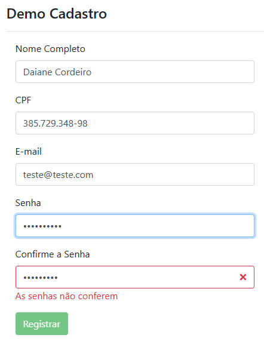

# Testes de Unidade e E2E - Angular 19

> Projeto de estudos utilizado no módulo **Testes de Unidade (Unit Tests)**, com foco na evolução das estratégias de teste ao longo das versões do Angular.
O módulo parte da abordagem clássica com Jasmine, Karma e Protractor (Angular 8) e evolui para a abordagem moderna com Playwright no Angular 19, mantendo conceitos fundamentais de testes unitários e end-to-end.

---

## O que foi estudado
- Diferença entre `Testes Unitários`, `integração` e `E2E`.
- Uso do Playwright como ferramenta E2E.
- Abandono do Protractor (descontinuado).
- Testes mais próximos da experiência real do usuário.
- Analise de cobertura de código `(Code Coverage)`.
- Uso de seletores semânticos:
    - getByRole
    - getByText
    - locator
- Simulação real de digitação com:
    - pressSequentially
- Execução de testes em múltiplos navegadores:
    - Chromium
    - Firefox
    - WebKit
- Execução em modo visual (headed) e modo debug (--debug).
- Uso de page.pause() para inspeção visual do teste.
- Separação clara entre:
    - Testes unitários (`Jasmine + Karma`)
    - Testes E2E (`Playwright`)
---

## Estrutura principal do módulo
- TestesUnidade    
    - coverage
        - meu-projeto
    - e2e
        - `cadastro.spec.ts` >> Testes do Formulário de Cadastro
        - `home.spec.ts` >> Testes da Página Inicial    
        - `tsconfig.json` 
- `playwright.config.ts` >> Configuração do Playwright
---

## Scripts Importantes (Package.json)
- Exemplo do conteúdo:
```
"scripts": {
  "start": "ng serve",
  "test": "ng test",
  "e2e": "playwright test",
  "e2e:headed": "playwright test --headed",
  "e2e:debug": "playwright test --debug",
  "mock": "json-server --watch mock/api.json --port 3000",
  "dev": "concurrently \"npm run mock\" \"npm start\""
}
```
---

## Preview do projeto


## Tecnologias
- [Angular 19](https://angular.dev/)
- Typescript
- HTML / CSS
- Playwright
- Karma
- Jasmine

## Como executar
```
- npm install
- npm run dev
- Acesse no navegador: http://localhost:4200
- Testes Unitários: npm run test
- Testes E2E com navegador visível: npm run e2e:headed
- Testes E2E em modo debug: npm run e2e:debug
```
---

## Anotações importantes
- Para simular o comportamento real do usuário, foi utilizado:
    - pressSequentially com delay.
- page.pause() é usado apenas para debug local, nunca em CI.
- Testes E2E não substituem testes unitários.
- Testes E2E validam comportamento do usuário, não regras de negócio internas.
- O Playwright trouxe:
    - Mais estabilidade
    - Melhor debug
    - Testes mais próximos da realidade do usuário
- Foi realizada a transição entre Angular antigo e o Angular 19, ajustando os testes para a linguagem mais moderna.    