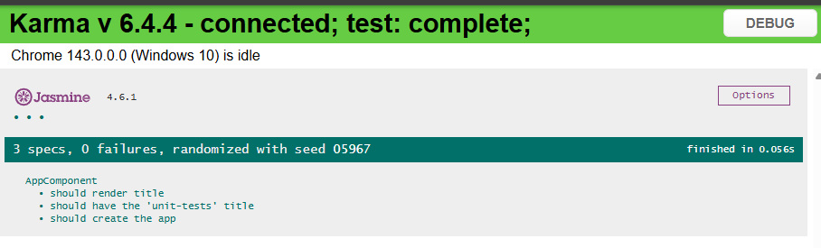

# Testes Unitários no Angular (Projeto Default) – Angular 19

> Projeto **base** criado com o Angular CLI (Angular 19) apenas para **visualizar e validar a estrutura padrão de testes** do Angular 19.  

- Este projeto não aprofunda conceitos de testes unitários. Ele existe exclusivamente para entender **o papel dos arquivos `.spec.ts`, do e2e, e confirmar que o Karma, Jasmine e o Playwright estão corretamente configurados e “escutando” a aplicação**, conforme demonstrado em aula.

---

## O que foi estudado
- Arquivo `app.component.spec.ts` como exemplo de teste unitário.
- Estrutura básica de um `describe` e `it`.
- Arquivo `test.ts` como bootstrap dos testes.
- Arquivo `karma.conf.js` como configuração do test runner.
- Execução dos testes no navegador.
- Geração de relatório de cobertura `(coverage)`.

---

## Estrutura principal do projeto
```
UNIT-TESTS-DEFAULT
├─ coverage/               # Relatório de cobertura de testes
├─ e2e/                    # Estrutura básica de testes end-to-end
├─ public/
│  └─ favicon.ico
├─ src/
│  ├─ app/
│  │  ├─ app.component.css
│  │  ├─ app.component.html
│  │  ├─ app.component.spec.ts   # Testes unitários do componente
│  │  ├─ app.component.ts
│  │  ├─ app.config.ts
│  │  └─ app.routes.ts
│  ├─ environments/
│  │  ├─ environment.development.ts
│  │  └─ environment.ts
│  ├─ index.html
│  ├─ main.ts
│  ├─ styles.css
│  └─ test.ts               # Arquivo de bootstrap dos testes
├─ angular.json
├─ karma.conf.js            # Configuração do Karma
├─ package.json
├─ tsconfig.app.json
├─ tsconfig.json
├─ tsconfig.spec.json
└─ README.md
```

---

## Testes Unitários
- Framework: **Jasmine**
- Test runner: **Karma**
- Os testes:
  - São executados automaticamente ao rodar `ng test`
  - Ficam “escutando” alterações no código
  - São exibidos em tempo real no navegador

> Neste projeto, os testes **não foram escritos nem estendidos**, apenas observados.

---

## Testes e2e
- A pasta `e2e` contém apenas a estrutura inicial.
- Não foram criados nem executados testes end-to-end neste módulo.
- O objetivo foi apenas identificar a separação entre:
  - Testes unitários
  - Testes e2e

---

## Preview do projeto


## Tecnologias
- [Angular 19](https://angular.dev/)
- Typescript
- HTML / CSS
- Karma
- Jasmine
- Playwright

## Como executar
```
- npm install
- ng test
- O navegador é aberto automaticamente pelo Karma
- A execução confirma que o ambiente está corretamente configurado
```
---

## Anotações importantes
- Projeto criado com Angular 19, enquanto o curso utiliza Angular 8.
- A diferença de versões não impacta o objetivo deste módulo.
- Este repositório serve apenas como:
  - Referência estrutural
  - Registro do conteúdo apresentado em aula
- O estudo aprofundado de testes será feito em outro projeto separado.
